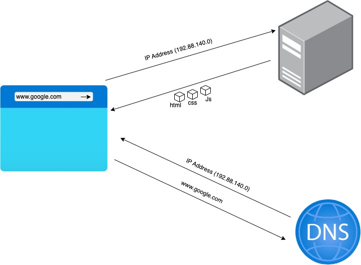
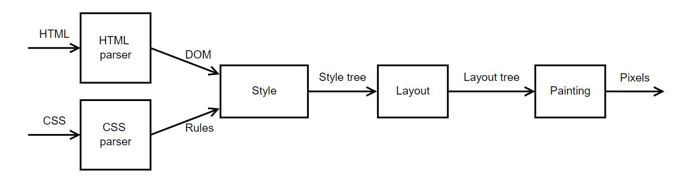

# What is a Internet Browser
̊Browse in english languages mean `an act of casual looking or reading` and Browser is the platform you are using. Thus, a **Internet Browser is a Software which helps you browse things(content) on Internet**.

# What happens when you enter a url ?

Let's take www.google.com 
when you enter googl.com and hit enter. The browser will ask his father **"DNS"** for the google.com address. Why father because his father knows everyone's address on the internet. So, the **DNS(Domain Name System)** will give browser the address of google.com in the form of **IP address** (like home address, on internet we have IP address) for e.g. 192.99.140.0.
 

 
So, the browser will go to this IP address and ask google Server's (home of google) for the response to the URL hit.
They will send give him a box full of different items`(html, css, javascript)` and he will come back with those.
Now, its time to open the box and arrange them in manner so that you can see it on the screen.

As Simple as it!

# What is the main functionality of Browser?
The primary function of a web browser is to render HTML, the code used to design or "mark up" webpages. Each time a browser loads a web page, it processes the HTML, which may include text, links, and references to images and other items, such as cascading style sheets and JavaScript functions. The browser processes these items, then renders them in the browser window. 
 

# High Level Components of a browser

Primary components of a browser are:

**User Interface** – This consists of forward and back button, bookmarks, address bar etc. along with the window that displays the requested page.

**Browser engine** – It commands action between rendering engine and the user interface.

**Rendering engine** – The main function of rendering engine is to display the content that is requested. For example, if an HTML content is requested, the engine parses CSS and HTML and when the content is parsed, it is displayed on the screen.

**Networking** - The networking components are responsible for establishing a connection to the web server and sending and receiving data. The networking components receive the HTML code for the webpage and pass it to the rendering engine.

**UI Backend** - used for drawing basic widgets like combo boxes and windows. This backend exposes a generic interface that is not platform specific. Underneath it uses operating system user interface methods.

**JavaScript Interpreter** - The script processors are responsible for executing any JavaScript code on the page. This can include functions that manipulate the content of the page, such as changing the styles of elements or interacting with the user.

**Data Storage** - This is a persistence layer. The browser may need to save all sorts of data locally, such as cookies. Browsers also support storage mechanisms such as localStorage, IndexedDB, WebSQL and FileSystem.

# Rendering engine and its use.
When a web page is loaded, the browser first reads the HTML text and constructs **DOM Tree** from it. Then it processes the CSS whether that is inline, embedded, or external CSS and constructs the **CSSOM Tree** from it. After these trees are constructed, then it constructs the **Render-Tree** from it. Once the Render-Tree is constructed, then the browser starts the printing individual elements on the screen.

* Rendering helps you to present the content on a webpage
* It makes use of HTML, CSS files to design the webpage however is required.
* The design of the webpage and what would be the functionality of the web page is decided by the developer who designs the page.
* Based on the design, the end-user will be able to understand the content, it would make the usage of the page easier for the end-user

# Parsers (HTML, CSS, etc)
Parsing is the process of reading HTML content and constructing a **DOM Tree** from it. Hence the process is also called DOM parsing and the program that does that is called the DOM parser.

# HTML Parser
The job of the HTML parser is to parse the HTML markup into a parse tree. Similar to HTML parsing, CSS parsing also starts by tokenizing the CSS source code into tokens, which are then parsed into CSS rules.

# Script Processer
Script processors are components of a web browser that are responsible for executing JavaScript code on a webpage. 

The script processor executes Javascript code to process an event. The processor uses a pure Go implementation of ECMAScript 5.1 and has no external dependencies. This can be useful in situations where one of the other processors doesn’t provide the functionality you need to filter events.
**Order of Script Processing**

- `<script> in <head>` - VeryHigh (Blocks parser) 
- `<script type=module async>` - High (Interupts Parsser)
- `<script async>` - High (Interupts Parsser)
- `<script> at the end of <body>` - Low (Waits parser end)
- `<link rel=prefetch>` + `<script>` in a next-page navigation - Depends on when and how the script is consumed.
# Tree construction
When the browser reads HTML code, whenever it encounters an HTML element like html, body, div etc., it creates a JavaScript object called a Node. Eventually, all HTML elements will be converted to JavaScript objects.

A DOM tree starts from the topmost element which is html element and branches out as per the occurrence and nesting of HTML elements in the document. Whenever an HTML element is found, it creates a DOM node (Node) object from its respective class (constructor function).

A DOM node doesn’t always have to be an HTML element. When the browser creates a DOM tree, it also saves things like comments, attributes, text as separate nodes in the tree. But for the simplicity, we will just consider DOM nodes for HTML elements AKA DOM element.

# Order of processing
Scripts - The model of the web is synchronous. Authors expect scripts to be parsed and executed immediately when the parser reaches a script tag. The parsing of the document halts until the script has been executed. If the script is external then the resource must first be fetched from the network–this is also done synchronously, and parsing halts until the resource is fetched.

Speculative parsing - Both WebKit and Firefox do this optimization. While executing scripts, another thread parses the rest of the document and finds out what other resources need to be loaded from the network and loads them. In this way, resources can be loaded on parallel connections and overall speed is improved.

Style sheets - Style sheets on the other hand have a different model. Conceptually it seems that since style sheets don't change the DOM tree, there is no reason to wait for them and stop the document parsing.

# Layout and Painting
The DOM and CSSOM trees are combined to form the render tree.
Render tree contains only the nodes required to render the page.
Layout computes the exact position and size of each object.
The last step is paint, which takes in the final render tree and renders the pixels to the screen.

[def]: function